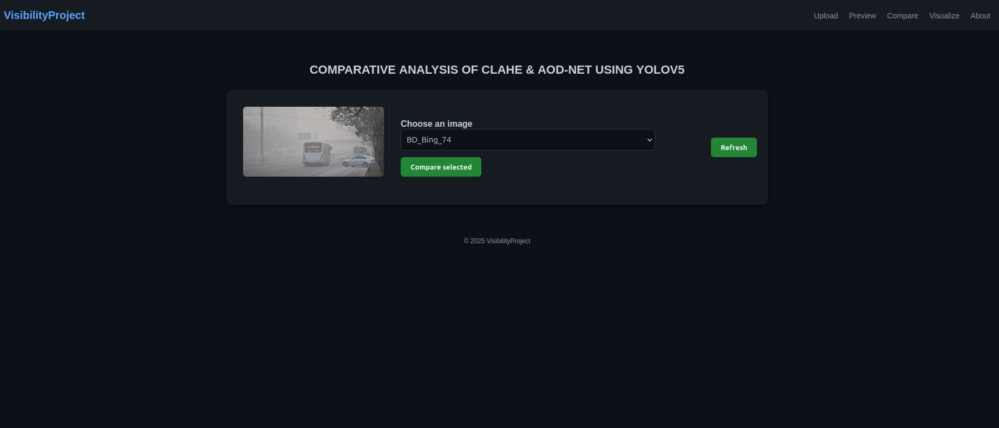
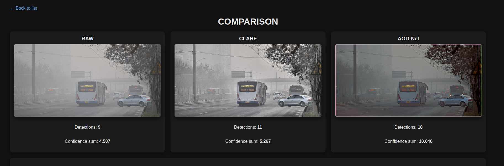
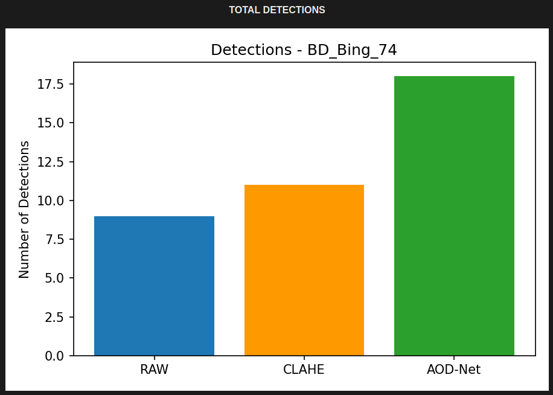
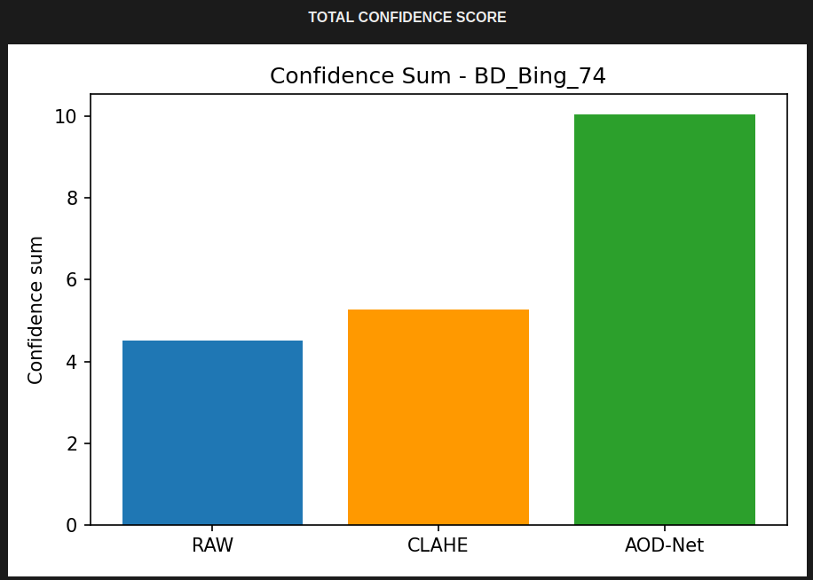

# Visibility Project (RAW / CLAHE / AOD-Net) — YOLOv5

Short description: compare RAW, CLAHE and AOD-Net processed images using YOLOv5 and show results via Flask GUI.

## Run locally
1. create virtualenv: `python3 -m venv venv`
2. activate: `source venv/bin/activate`
3. install: `pip install -r requirements.txt`
4. run: `python app.py`

Add screenshots to `static/screenshots/` and reference them in this README.
# VisibilityCompare

This is my MCA project (RAW, CLAHE, and AOD-Net comparison).

## Screenshots

### Home Page

### Comparison Page

